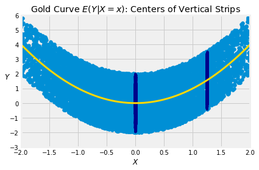
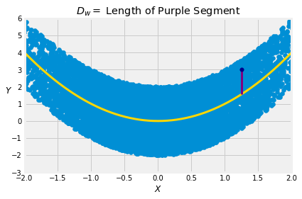

---
redirect_from:
  - "/chapter-22/01-conditional-expectation-projection"
interact_link: notebooks/Chapter_22/01_Conditional_Expectation_Projection.ipynb
title: 'Conditional Expectation As a Projection'
prev_page:
  url: /Chapter_22/00_Prediction
  title: 'Chapter 22: Prediction'
next_page:
  url: /Chapter_22/02_Variance_by_Conditioning
  title: 'Variance by Conditioning'
comment: "***PROGRAMMATICALLY GENERATED, DO NOT EDIT. SEE ORIGINAL FILES IN /notebooks***"
---

## Conditional Expectation As a Projection

Suppose we are trying to predict the value of a random variable $Y$ based on a related random variable $X$. As you saw in Data 8, a natural method of prediction is to use the "center of the vertical strip" at the given value of $X$.

Formally, given $X=x$, we are proposing to predict $Y$ by $E(Y \mid X=x)$.

{:.output .output_png}

The conditional expectation $E(Y \mid X)$ is the function of $X$ defined by

$$
b(x) ~ = ~ E(Y \mid X = x)
$$

We are using the letter $b$ to signifiy the "best guess" of $Y$ given the value of $X$. Later in this chapter we will make precise the sense in which it is the best. 

In random variable notation,
$$
E(Y \mid X) ~ = ~ b(X)
$$

For a point $(X, Y)$, the error in this guess is

$$
D_w = Y - b(X)
$$

The subscript $w$ reminds us that this error is a deviation *within* a vertical strip – it is the difference between $Y$ and the center of the strip at the given value of $X$.

{:.output .output_png}

To find properties of $b(X)$ as an estimate of $Y$ it will be helpful to recall some properties of conditional expectation. 

### Conditional Expectation: Review
The properties of conditional expectation are analogous to those of expectation, but the identities are of random variables, not real numbers. There are also some additional properties due to the aspect of conditioning. We provide a list of the properties here for ease of reference.

- **Linear transformation**: $E(aY + b \mid X) ~ = ~ aE(Y \mid X) + b$
- **Additivity**: $E(Y + W \mid X) ~ = ~ E(Y \mid X) + E(W \mid X)$
- **"The given variable is a constant"**: $E(g(X) \mid X) ~ = ~ g(X)$
- **"Pulling out" constants**: $E(g(X)Y \mid X) ~ = ~ g(X)E(Y \mid X)$
- **Independence**: If $X$ and $Y$ are independent then $E(Y \mid X) = E(Y)$, a constant.
- **Iteration**: $E(Y) = E\big{(}E(Y \mid X)\big{)}$

Now
$$
E(D_w \mid X) ~ = ~ E(Y \mid X) - E(b(X) \mid X) ~ = ~ b(X) - b(X) = 0
$$

In other words, the average of the deviations within a strip is 0.

By iteration,
$$
E(D_w) ~ = ~ 0 ~~~~~~ \text{and} ~~~~~~ E\big{(}b(X)\big{)} = E(Y)
$$

### $D_w$ and Functions of $X$

Let $g(X)$ be any function of $X$. Then the covariance of $g(X)$ and $D_w$ is

$$
Cov\big{(}g(X), D_w\big{)} ~ = ~ E\big{(}g(X)D_w\big{)} 
$$

because $E(D_w) = 0$. By iteration,

$$
\begin{align*}
E(g(X)D_w) ~ &= ~ E\big{(}E(g(X)D_w \mid X)\big{)}\\
&= ~ E\big{(}g(X)E(D_w \mid X)\big{)}\\
&= ~ 0
\end{align*}
$$

Thus the deviation from the conditional mean, which we have denoted $D_w$, **is uncorrelated with functions of $X$**.

This is a powerful *orthogonality* property that will be used repeatedly in this chapter. As an informal visual image, think of the space of all possible functions of $X$ to be the surface of a table. Imagine $Y$ to be a point above the table. To predict $Y$ by a function of $X$ it makes sense to find the point on the table that is closest to $Y$. So drop the perpendicular from $Y$ to the table. 
- The point where the perpendicular hits the table is $b(X)$. We say that the conditional expectation of $Y$ given $X$ is the *projection* of $Y$ on the space of functions of $X$.
- $D_w$ is the perpendicular; it is orthogonal to the table.

Later in this chapter we will see in exactly what sense $b(X)$ is the best guess for $Y$.
